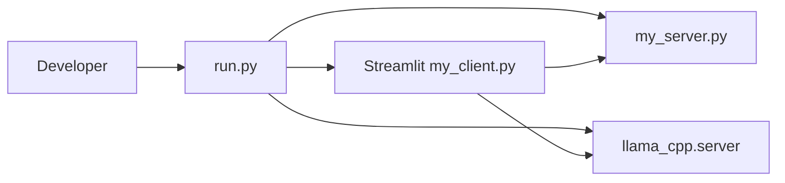

## Goal

Extend `run.py` so that, when configured via environment variables, it automatically starts a local tools-capable LLM server (e.g., `llama-cpp-python` OpenAI-compatible server) alongside the existing MCP server and Streamlit client. This should keep the default behavior simple while eliminating most “connection error” issues during local dev.

## Architecture Overview

- `run.py` becomes the orchestrator for three processes: MCP server, optional LLM server, and Streamlit client.
- `my_client.py` continues to talk to the LLM server via `AGENTIC_ODI_BASE_URL` / sidebar config (defaulting to `http://localhost:8001/v1`).

## Plan

### 1. Define configuration and env vars for the LLM server

- **File**: `[c:\GIT repositories\agentic-odi\run.py](c:\GIT repositories\agentic-odi\run.py)`.
- Introduce constants and environment-driven configuration:
  - `LLM_PORT` defaulting to `8001` (matching `my_client.py` and README).
  - Env vars:
    - `AGENTIC_ODI_LLM_MODEL_PATH` (required to enable LLM launcher).
    - Optional overrides:
      - `AGENTIC_ODI_LLM_MODEL_ALIAS` (default: `local-tools-model`).
      - `AGENTIC_ODI_LLM_CHAT_FORMAT` (default: `functionary-v2`).
      - `AGENTIC_ODI_LLM_TOKENIZER_PATH` (optional, for Functionary HF tokenizer path; if not set, default to the model directory).
- The presence of `AGENTIC_ODI_LLM_MODEL_PATH` acts as the feature toggle: if it’s unset/empty, `run.py` behaves exactly as today (MCP + Streamlit only).

### 2. Add an LLM port check and launcher

- **File**: `[c:\GIT repositories\agentic-odi\run.py](c:\GIT repositories\agentic-odi\run.py)`.
- Implement `start_llm_server()` mirroring `start_server()` / `start_client()`:
  - If `AGENTIC_ODI_LLM_MODEL_PATH` is unset, return `None` and print a short message stating that the LLM server is being skipped.
  - If set:
    - Check if `LLM_PORT` is already in use; if so, print a warning that an LLM server is already running on that port and **skip starting a new one**, returning `None` (or possibly attaching to that external process only logically).
    - Otherwise, construct a `subprocess.Popen` call to:
      - `python -m llama_cpp.server` (using `sys.executable` for portability).
      - With `--host 127.0.0.1 --port <LLM_PORT>`.
      - With `--model <AGENTIC_ODI_LLM_MODEL_PATH>`.
      - With `--model_alias <AGENTIC_ODI_LLM_MODEL_ALIAS>`.
      - With `--chat_format <AGENTIC_ODI_LLM_CHAT_FORMAT>`.
      - With `--hf_pretrained_model_name_or_path <AGENTIC_ODI_LLM_TOKENIZER_PATH or model_dir>`.
    - Print a clear message indicating the exact command (or key args) being run so devs can reproduce it manually if needed.

### 3. Integrate LLM server into lifecycle and shutdown

- **File**: `[c:\GIT repositories\agentic-odi\run.py](c:\GIT repositories\agentic-odi\run.py)`.
- In `main()`:
  - Add an `llm = None` variable alongside `server` and `client`.
  - Call `llm = start_llm_server()` **after** checking MCP port and before starting the Streamlit client (so the LLM is ready by the time the UI comes up), with a small `time.sleep` delay if needed.
  - Extend the `shutdown()` function to terminate and wait/kill the LLM process similarly to `server` and `client`:
    - `if llm: llm.terminate()`; then wait with timeout; on timeout, `llm.kill()`.
  - In the main monitoring loop, optionally check `llm.poll()` and log if the LLM server exits unexpectedly (but don’t necessarily break the loop unless you want `run.py` to stop when the LLM dies).

### 4. Ensure configuration alignment with `my_client.py` and README

- **Files**:
  - `[c:\GIT repositories\agentic-odi\my_client.py](c:\GIT repositories\agentic-odi\my_client.py)` (already defaulting to `http://localhost:8001/v1` and model `local-tools-model`).
  - `[c:\GIT repositories\agentic-odi\README.md](c:\GIT repositories\agentic-odi\README.md)` (already documents local tools-capable backend).
- Verify and, if necessary (in future steps), adjust docs so they mention:
  - That `python run.py` can start all three processes when `AGENTIC_ODI_LLM_MODEL_PATH` is set.
  - Which env vars control the LLM launcher and how they map to the defaults in `my_client.py`.
- The plan here is to **keep the code defaults and documentation consistent** so that anyone following the README gets a working `python run.py` experience without extra guesswork.

### 5. Keep behavior safe and non-intrusive by default

- Do not start any LLM server unless explicitly opted in via `AGENTIC_ODI_LLM_MODEL_PATH`.
- When enabled, be verbose but not noisy: log which model path, alias, and port are used.
- If the port is already occupied, **do not fail**; instead, assume the developer has an external LLM server and just print a clear message that the launcher is skipping startup.
